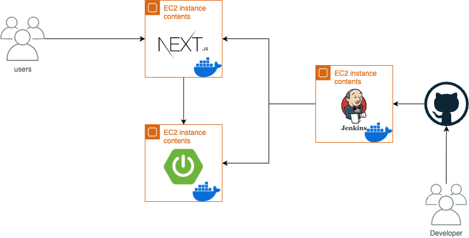
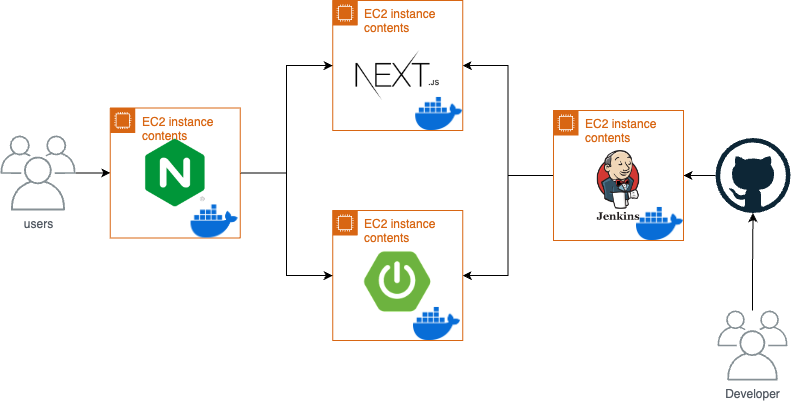

# NGINX를 사용하는 이유를 알아보자

## **NGINX**

- **정적 애플리케이션을 지원하는 웹 서버**
  - 정적인 콘텐츠(HTML, CSS, JavaScript 파일)를 빠르게 제공하는 데 최적화.
  - WAS(Web Application Server)의 역할도 할 수 있지만, **주 기능은 리버스 프록시 및 정적 콘텐츠 제공**.
- **Apache와의 차이점**
  - Apache는 **프로세스 기반**으로 동작하며, 요청마다 프로세스를 생성. 이는 많은 요청 처리 시 리소스 소모가 큼.
  - NGINX는 **이벤트 기반**으로 동작하여 요청마다 별도의 프로세스를 생성하지 않고, 단일 프로세스 내에서 요청을 효율적으로 처리.
  - **이벤트 기반이란?**
    - 요청을 비동기적으로 처리하며, CPU 컨텍스트 스위칭이 줄어들어 성능 향상.
    - 특히 고트래픽 환경에서 NGINX의 강점이 발휘됨.

## **NGINX의 핵심 기능**

1. **리버스 프록시 (Reverse Proxy)**
   - 클라이언트와 WAS 사이에 위치하여 **중개 역할** 수행.
   - **기능 및 장점**:
     - **보안 강화**: WAS 서버의 IP나 포트 정보를 클라이언트에게 노출하지 않아 공격 위험 감소.
     - **로드 밸런싱**: 다수의 WAS 서버에 요청을 분산, 서버 부하 관리 가능.
     - **캐싱**: 정적 콘텐츠를 캐싱하여 성능 최적화.
2. **로드 밸런싱**
   - 다수의 백엔드 서버로 트래픽을 효율적으로 분산.
   - 여러 알고리즘(라운드 로빈, Least Connections 등)을 지원.
3. **정적 파일 제공**
   - 정적 콘텐츠(HTML, CSS, JS)를 빠르게 처리하여 WAS의 부하를 줄임.

## **NGINX 적용 서버 예시**

- 현재 진행중인 프로젝트를 바탕으로 서버 구조도를 작성했다. 데이터베이스 서버가 없는 이유는 supabase를 쓰기때문에 우선 생략했다…

### **NGINX 사용 전 요청 흐름**

1. 사용자가 80번 포트(HTTP 요청)를 통해 프론트엔드 서버에 접근.
2. 프론트엔드 서버에서 API 호출을 통해 백엔드 서버에 직접 요청.

### **NGINX 사용 후 요청 흐름**

1. 사용자가 80번 포트(HTTP 요청)를 통해 **NGINX 서버**에 접근.
2. NGINX 서버가 요청 URL에 따라 트래픽을 적절히 라우팅.
   - 정적 요청(React 정적 파일 제공)은 프론트엔드 **서버**로 전달.
   - API 요청은 백엔드 **서버**로 전달.
3. **NGINX는 클라이언트와 백엔드 간의 요청을 중개하며 보안을 강화하고, 부하를 효율적으로 분산**

export const metadata = {
  title: "NGINX를 사용하는 이유를 알아보자",
  createdAt: "2024-11-18T21:20:00Z",
  tags: ["NGINX", "Server"],
};
